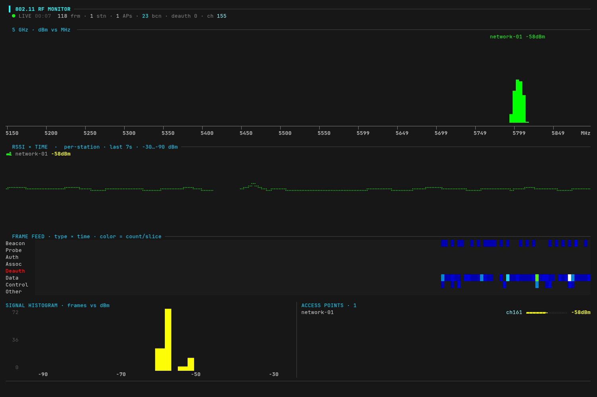

# airtop

**htop for the airwaves** — a live 802.11 (Wi-Fi) RF dashboard in your terminal.

<p align="center">
  
  
  
</p>

<p align="center">
  
</p>

**airtop turns the Wi-Fi traffic around you into a live terminal dashboard** — a frequency spectrum of nearby access points, per-station signal traces, a frame-type activity feed, an RSSI histogram, and a rolling list of discovered networks — drawn with braille and block graphics over eBPF.

> [!TIP]
> **No monitor mode, no raw sockets.** airtop attaches eBPF programs to `mac80211`/`cfg80211` and reads 802.11 frames as they flow through the kernel's Wi-Fi stack, so it runs on your normal, connected interface without dropping your link.

## Quick start

```sh
curl -fsSL https://yeet.cx | sh
yeet run https://github.com/yeet-src/airtop
```

For a shareable screenshot, anonymize SSIDs and MACs (your network and your neighbors' get relabeled `network-01`, `station-02`, …):

```sh
yeet run https://github.com/yeet-src/airtop -- --anonymize
```

Runs until `Ctrl-C`. Resize the terminal and the layout reflows; minimum 80×24.

To surface neighboring networks the kernel needs scan results. Your OS scans periodically on its own, or force one:

```sh
nmcli dev wifi rescan        # or: iw dev <iface> scan
```

## A 60-second 802.11 primer

Wi-Fi is the IEEE 802.11 family of standards. The mental model:

**Everything is a frame.** Your laptop, phone, and router exchange short radio packets called frames. Every frame carries MAC addresses, and one of them (the **BSSID**) identifies the access point it belongs to.

**Three classes of frame:**

| Class | Examples | Purpose |
|---|---|---|
| Management | Beacon, Probe, Auth, Assoc, Deauth | advertise, join, and leave networks |
| Control | ACK, RTS/CTS | coordinate who gets to talk |
| Data | your actual traffic | carry payloads |

**Access points beacon.** An AP announces itself ~10 times a second with a beacon frame carrying its network name (SSID) and BSSID. That's how your phone's Wi-Fi list gets populated, and how airtop discovers APs.

**Channels & frequency.** Wi-Fi lives in bands (2.4 GHz, 5 GHz, 6 GHz), each split into channels, and every channel is a center frequency in MHz (channel 6 ≈ 2437 MHz, channel 161 ≈ 5805 MHz). A radio listens to one channel at a time, which is why you mostly see traffic on your channel.

**Signal strength (RSSI)** is measured in dBm. Values are always negative, and closer to zero is stronger:

| RSSI | quality |
|---|---|
| −30 … −50 dBm | excellent (right next to it) |
| −50 … −67 dBm | good |
| −67 … −80 dBm | usable |
| −80 … −90 dBm | weak / marginal |

## Common use cases

Mostly home users debugging flaky Wi-Fi, and netadmins picking channels before an event.

- Your video call stutters. Is your channel congested?
- A guest can't connect. Is the AP even beaconing?
- Picking a channel for a demo. What's the RF environment look like?
- Deauth frames spike. Attack, or misbehaving router?

## What you're looking at

Each panel maps onto the concepts above:

**Header** — uptime, total frames seen, live stations, discovered APs, beacon count, deauth count (red if any non-zero), and your current channel. The deauth counter is the one to keep an eye on; healthy networks have zero.

**Frequency spectrum** — every discovered AP drawn as a signal "hump" positioned at its real center frequency on a MHz axis. Height and color show RSSI; the label is the SSID + dBm. **Overlapping humps reveal co-channel congestion** — the classic Wi-Fi-analyzer view, and the answer to "why is my Wi-Fi slow."

**RSSI × time** — a braille line graph per live station plotting its signal over the last several seconds. Watch a link fade as a device walks away from the AP, or jump when someone moves their laptop.

**Frame feed** — a heatmap of frame types over time; cell color = how many of that type arrived per slice. **A deauth flood lights up that row instantly**, which is the alert pattern you actually want.

**Signal histogram** — distribution of received frames by RSSI. The "shape" of your RF environment: a tight peak around −50 dBm means you're close to one strong AP, a smear across −60 to −80 means a crowded environment.

**Access points** — discovered SSIDs with channel, signal gauge, and dBm, sorted strongest-first.

## How it works

A single BPF object (`airtop.bpf.c`) attaches two `fentry` programs and streams events to userspace over ring buffers:

| Hook | What it captures |
|---|---|
| `fentry/ieee80211_rx_list` | every received 802.11 frame: type/subtype, addresses, RSSI from `ieee80211_rx_status` |
| `fentry/cfg80211_inform_bss_frame_data` | every AP the kernel's scans discover: SSID, channel, signal |

The dashboard runs in yeet's V8 runtime, subscribing to those ring buffers and rendering the terminal UI:

```
main.js       entry: tty size, render loop, BPF bind/subscribe
state.js      live data + frame/scan ingest
render.js     ANSI, color ramps, braille canvas/charts (pure)
dashboard.js  panels + layout (renderDashboard)
```

## Requirements

> [!IMPORTANT]
> Linux with BTF: `CONFIG_DEBUG_INFO_BTF=y` and `CONFIG_DEBUG_INFO_BTF_MODULES=y`. Default on current Arch, Fedora, Ubuntu, and Debian 12+. CO-RE means no per-kernel recompile.

- A Wi-Fi interface using the standard `cfg80211`/`mac80211` stack (any normal Wi-Fi card on Linux).
- The yeet daemon, which handles the privileged BPF load. `curl -fsSL https://yeet.cx | sh` installs it.

## Honest caveats

> [!NOTE]
> What airtop doesn't do:

- A connected interface only hears its own channel plus whatever brief scans touch, so the spectrum and AP list fill in as scans run, and live per-frame traffic is mostly your channel. A full-band survey would need monitor mode + channel hopping.
- It counts frames, not bytes. "Activity" is frame count, not airtime.
- TX rate and retries aren't captured. That's a separate `tx_status` hook.
- The `fentry` targets are stable in practice but not a kernel ABI; exact data depends on your Wi-Fi driver.

## Community questions

**Does this need monitor mode?**
No. That's the whole point. airtop hooks the kernel's Wi-Fi stack from inside, so it works on your normal connected interface.

**Will it drop my connection?**
No. There's no mode switch; your interface stays associated to whatever it's associated to. airtop is observing what the kernel is already doing.

**Why do I only see one or two networks?**
Because your radio is listening to one channel (its own) most of the time. Neighboring networks show up when your OS does periodic scans, or when you force one with `nmcli dev wifi rescan` / `iw dev <iface> scan`. A full-band survey needs monitor mode + channel hopping, which is a different tool.

**Is this legal?**
Passively observing 802.11 frames in the air around you is legal in most jurisdictions; your radio is already receiving them, and airtop just shows you what's there. Active interference (the deauth panel *detects* attacks, it doesn't perform them) is a different story. If you're on a corporate network, check your AUP.

**How is this different from Kismet, airodump-ng, or Wireshark?**
Those tools do more with monitor mode: full per-frame capture, PCAP export, decryption. airtop runs on your normal interface and gives you an at-a-glance dashboard. For pen-testing, use airodump-ng. To find out why your call dropped, use this.

## Building from source

```sh
make          # generates include/vmlinux.h, builds bin/airtop.bpf.o
make vmlinux  # force-refresh the kernel type header
make clean
```

Needs `clang` (BPF target) and `bpftool`; your distro's `libbpf` / `libbpf-dev` for headers. The generated `include/vmlinux.h` and `bin/` are gitignored.

## Recording the demo

The GIF is produced with [VHS](https://github.com/charmbracelet/vhs) from `assets/airtop.tape`:

```sh
vhs assets/airtop.tape    # -> assets/airtop.gif
```

It launches airtop off-camera so the GIF opens on the live dashboard. Kick off Wi-Fi scans in another shell while recording to fill the spectrum and AP list.

## License

The BPF program is GPL (`SEC("license") = "GPL"`), as required by the kernel helpers it uses.

---

Built by [yeet](https://yeet.cx). yeet is a Linux runtime for writing eBPF programs and live system dashboards in JavaScript.
